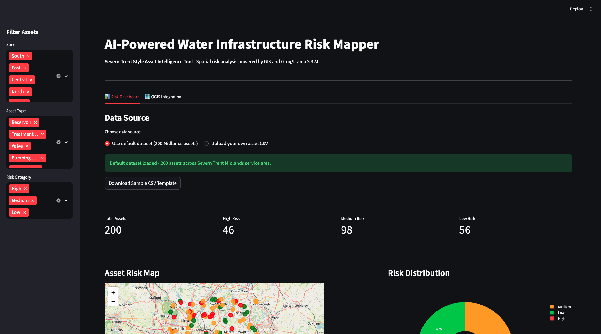
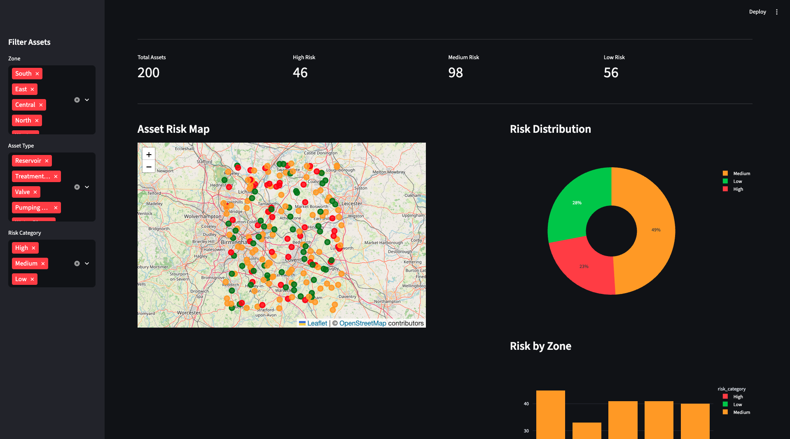
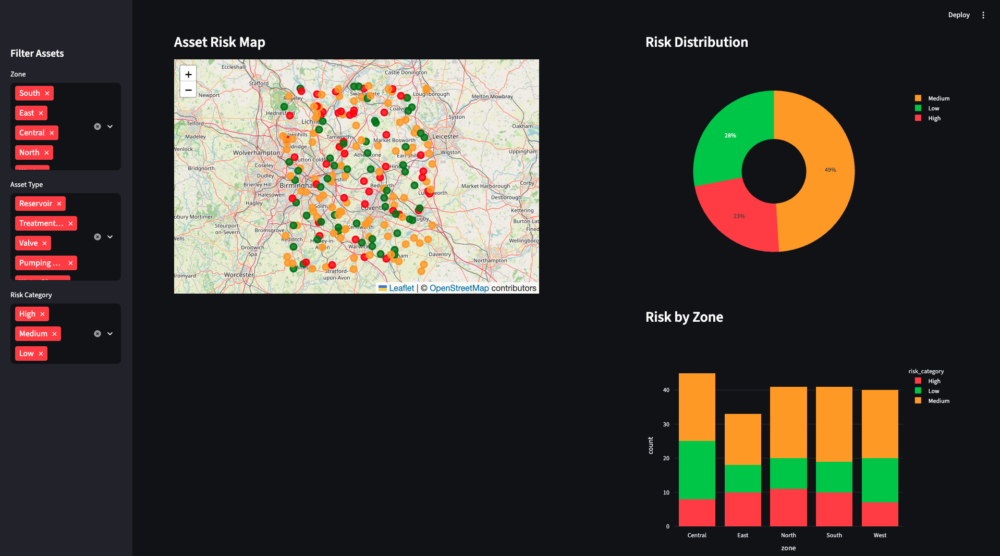
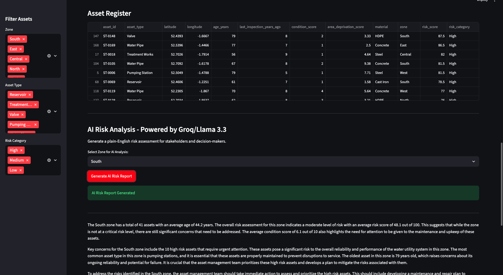
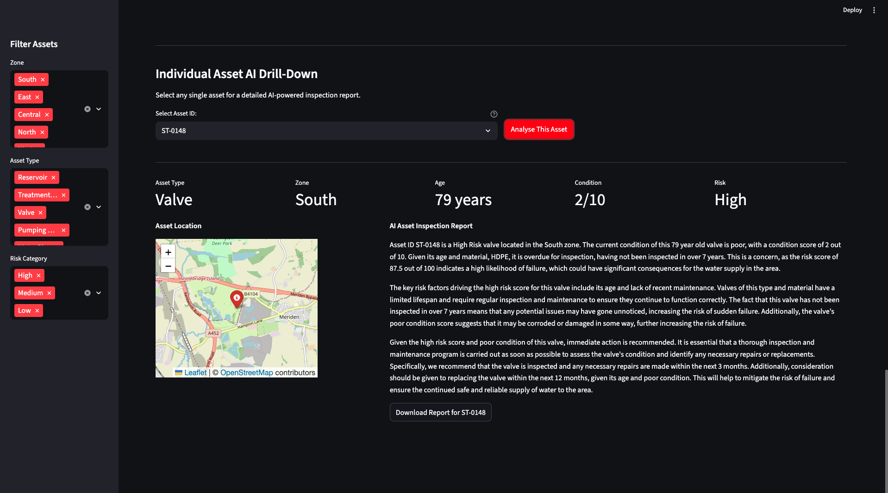
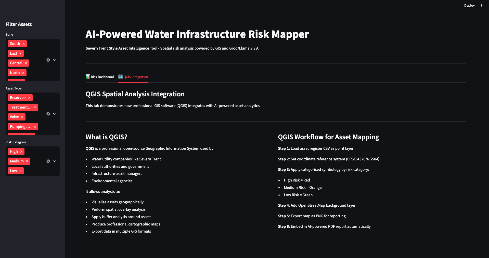
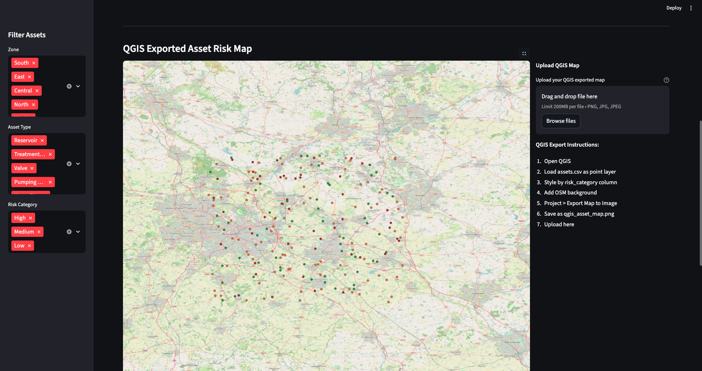

# 🗺️ AI-Powered Water Infrastructure Risk Mapper

An AI-powered GIS tool for water infrastructure asset risk analysis — combining QGIS spatial mapping with Groq/Llama 3.3 AI to identify high-risk assets and generate professional risk reports.

Built to replicate the Asset Intelligence workflow used by water utility companies like Severn Trent.

**Live Demo:** [Coming Soon]

---

## 🚀 Key Features

- **📍 Interactive GIS Risk Map** — 200 water infrastructure assets plotted across the Midlands using Folium
- **🔴 Risk Classification** — Automatic High/Medium/Low risk scoring based on age, condition, and inspection history
- **🤖 AI Zone Risk Reports** — Groq/Llama 3.3 generates plain-English risk assessments for stakeholders
- **🔍 Individual Asset Drill-Down** — Click any asset for AI-powered inspection report with mini map
- **📊 Analytics Charts** — Risk distribution, asset types, age distribution
- **📄 PDF Report Generation** — Professional 5-page PDF with charts, QGIS map, AI report, and asset register
- **🗺️ QGIS Integration** — Real QGIS-exported spatial analysis map embedded in app and PDF
- **📂 CSV Upload Mode** — Upload any asset register CSV for instant analysis

---

##  Screenshots

### 🏠 Landing Page & KPI Metrics


### 📍 Interactive GIS Risk Map


### 📊 Risk Distribution Charts


### 🤖 AI Zone Risk Report


### 🔍 Individual Asset AI Drill-Down


### 🗺️ QGIS Integration — Spatial Analysis Info


### 🗺️ QGIS Exported Asset Risk Map


---

## 🛠️ Tech Stack

| Tool | Purpose |
|------|---------|
| Python | Core programming language |
| Streamlit | Web application framework |
| QGIS | Professional GIS spatial analysis |
| Folium | Interactive web mapping |
| Groq / Llama 3.3 70B | AI risk report generation |
| Pandas | Data manipulation |
| Plotly | Interactive charts |
| Matplotlib | PDF chart generation |
| FPDF2 | PDF report creation |

---

##  How It Works

### Risk Scoring Algorithm
Each asset is scored 0-100 based on:
- **Age** (40% weight) — older assets score higher risk
- **Last Inspection** (30% weight) — longer since inspection = higher risk
- **Condition Score** (30% weight) — lower condition = higher risk

### Risk Categories
- 🔴 **High Risk** — Score 60+ — Immediate attention required
- 🟡 **Medium Risk** — Score 35-59 — Monitor closely
- 🟢 **Low Risk** — Score 0-34 — Routine maintenance

### GIS + AI Workflow
1. Load asset register (CSV) as geographic point layer
2. QGIS spatial analysis — overlay, buffer, graduated symbology
3. Python/Folium interactive map for web display
4. Groq/Llama 3.3 AI generates plain-English risk narratives
5. FPDF2 compiles professional 5-page PDF report

---

##  Dataset

Simulated water infrastructure asset register — 200 assets across the Midlands (Severn Trent service area):
- Asset types: Water Pipe, Pumping Station, Valve, Reservoir, Treatment Works
- Zones: North, South, East, West, Central
- Materials: Cast Iron, PVC, Steel, Concrete, HDPE
- Age range: 1-80 years

---

## ⚙️ Installation & Setup

```bash
# Clone the repository
git clone https://github.com/VinitBhalerao3012/asset-risk-mapper.git
cd asset-risk-mapper

# Create virtual environment
python3 -m venv venv
source venv/bin/activate

# Install dependencies
pip install -r requirements.txt

# Generate dataset
python3 generate_data.py

# Add your Groq API key
mkdir .streamlit
echo 'GROQ_API_KEY = "your_key_here"' > .streamlit/secrets.toml

# Run the app
streamlit run app.py
```

---

## API Keys Required

- **Groq API Key** — Free at [console.groq.com](https://console.groq.com)

---

##  Project Structure

```
asset-risk-mapper/
├── app.py
├── generate_data.py
├── requirements.txt
├── README.md
├── .gitignore
├── assets/
│   ├── S1-landing-page.png
│   ├── S2-interactive-map.png
│   ├── S3-risk-charts.png
│   ├── S4-ai-zone-report.png
│   ├── S5-asset-drilldown.png
│   ├── S6-qgis-info.png
│   └── S7-qgis-map.png
└── qgis_asset_map.png
```

## Author

**Vinit Bhalerao**
- LinkedIn: [linkedin.com/in/bhalerao-vinit3013](https://linkedin.com/in/bhalerao-vinit3013)
- Portfolio: [vinitbportfolio.netlify.app](https://vinitbportfolio.netlify.app)
- GitHub: [github.com/VinitBhalerao3012](https://github.com/VinitBhalerao3012)

---

## License

MIT License — feel free to use and adapt this project.